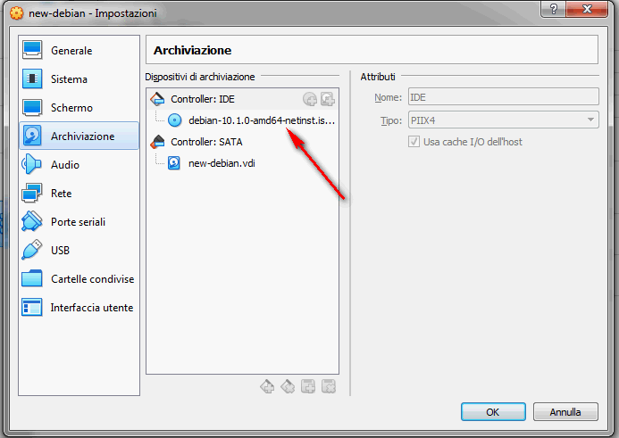

LINUX VM
---

### Installazione Linux

* scaricato ISO di installazione da https://saimei.ftp.acc.umu.se/debian-cd/current-live/amd64/iso-hybrid/debian-live-10.1.0-amd64-kde.iso  

* creato disco (min 20 giga, noi ne abbiamo allocati 30) 
* configurato cd a partire dalla iso scaricata

* fatta partire installazione con configurazioni abbastanza intuitive

### post installazione

* update
		sudo apt-get update

* creato utente paolo

	sudo useradd -m paolo -p paolo
	sudo groupadd developers

	sudo usermod -a -G developers paolo
	sudo usermod -aG sudo paolo
	#sudo usermod -aG docker paolo

	sudo chsh -s /bin/bash paolo
	
	sudo git config --global user.name "Nome Cognome"
	sudo git config --global user.email "indirizzo@mail.com"

* modificato .bashrc

		export ENGMSDIR=/var/eng-ms
		export PATH=$PATH:$ENGMSDIR/script/linux
		export MYGITUSER=******
		export MYGITPASSWORD=******

* clonato repository git

		cd /var
		git clone https://github.com/zawinul/eng-ms
		chgrp -R developers eng-ms #cambio gruppo a tutto il contenuto

* installato docker come da https://docs.docker.com/install/linux/docker-ce/debian/

* 
		sudo usermod -aG docker paolo

* installato jdk come descritto in https://tecadmin.net/install-oracle-java-on-debian-10-buster/

* installato maven come descritto in https://www.tecmint.com/install-apache-maven-on-ubuntu-debian/

* installato vs code come da istruzioni su https://code.visualstudio.com/docs/setup/linux

